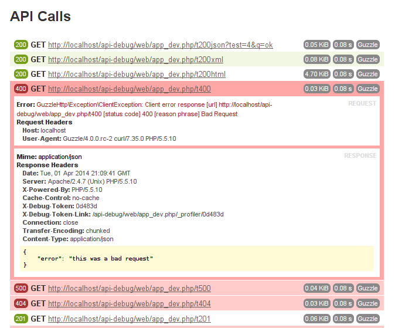

ApiDebugBundle
==============



This bundle adds a web debug toolbar tab which displays information about API consumer requests.

It aims to be universal and allow for easy integration with SDKs and HTTP client libraries.

Currently it supports [Guzzle 6](https://github.com/guzzle/guzzle) out-of-the box.

It should be extremely easy to integrate with any http client using PSR-7 messages.

For `Guzzle4`-compatible version use the `v1.0` tag.

## Requirements

* PHP 5.4
* Symfony 2.4

## Installation

The usual [Symfony stuff](http://symfony.com/doc/current/cookbook/bundles/installation.html).

The **composer.json** needs: `"pinkeen/api-debug-bundle": "dev-master",`.

The **AppKernel.php** needs: `new Pinkeen\ApiDebugBundle\PinkeenApiDebugBundle(),`.

Add the following to your `app/config/routing_dev.yml` if you want to be able to view raw body data:

```yml
_api_debug:
    resource: "@PinkeenApiDebugBundle/Resources/config/routing.yml"
    prefix:   /_profiler
```

## Usage

### Integrate with your custom client

Firstly you have to subclass 
[`AbstractCallData`](DataCollector/AbstractCallData.php) 
which holds data from a single API request.

If you are using a PSR-7 comptible client then you can use [`PsrCallData`](DataCollector\Data\PsrCallData.php)
instead of writing your own data class.

Then every time your API consumer makes a request dispatch an [`ApiEvents::API_CALL`](ApiEvents.php) event.

```php
    use Pinkeen\ApiDebugBundle\ApiEvents;
    use Pinkeen\ApiDebugBundle\Event\ApiCallEvent;
    
    /* ... */
    
    $serviceContainer->get('event_dispatcher')->dispatch(
        ApiEvents::API_CALL, 
        new ApiCallEvent(
            new YourApiCallData(/* your params */)
        )
    );
```

### Guzzle

You've got two options here, either:

*Let the bundle create the client for you...*

```php
    $serviceContainer->get('guzzle.client_factory')->create([
        /* Guzzle client config (optional).
         * It is passed directly to GuzzleHttp\Client constructor. */
    ]);
```

*... or push the collector handler to your middleware stack.*

```php
    $handler = new GuzzleHttp\HandlerStack(new GuzzleHttp\Handler\CurlHandler());
    $handler->push($serviceContainer->get('guzzle.collector_middleware')->getHandler());
    $client = new GuzzleHttp\Client(['handler' => $handler]);
```

### RingPHP

*Let the bundle create the handler for you:*

```php
    $handler = $serviceContainer->get('ring_php.handler_factory')->create(new CurlHandler());
```

*Use the collector_middleware service to create your RingPHP middleware and wrap it around your base handler:*

```php
    $ringPhpHandler = $serviceContainer
        ->get('ring_php.collector_middleware')
        ->createHandler(new GuzzleHttp\Ring\Client\CurlHandler(), 'apiname')
    ;

PS Nicely integrates with elasticsearch-php 2.0.

## Production

For production environment you probably want to skip all of the data gathering.

You should take care of that yourself, unless you're using `guzzle.client_factory` or `ring_php.handler_factory` which
skip it when not in debug mode.

## Notes 

I haven't found an easy way to get call duration out of guzzle6, so there's a regression here. If anybody has an idea
please give me a shout.
